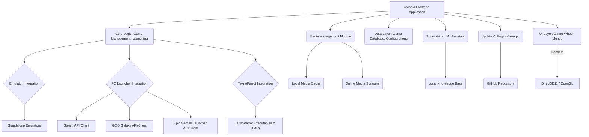

# Arcadia Frontend Launcher: System Architecture and Feature Design

This document outlines the proposed system architecture and detailed design for the unique features of the Arcadia frontend launcher, incorporating insights from the research phase and addressing all user requirements.

## 1. Overall System Architecture

Arcadia will be a standalone, high-performance desktop application designed for Windows, leveraging modern rendering APIs. Its architecture will be modular, allowing for extensibility and maintainability, particularly for the plugin ecosystem and future updates.

**Key Architectural Principles:**

*   **Modularity:** Clear separation of concerns for UI, core logic, data, and external integrations.
*   **Direct Execution:** Avoidance of intermediary scripting layers (e.g., AutoHotkey) for game and emulator launching.
*   **Performance:** Optimized for smooth animations and fast loading times, utilizing Direct3D11 and OpenGL.
*   **Extensibility:** Designed to support a plugin ecosystem for community contributions.
*   **Local-First:** Prioritizing local detection and management of games and configurations, with online services for media and updates.

## 2. Core Frontend Design

### 2.1. Rendering Engine

Arcadia will utilize **Direct3D11 and OpenGL** for rendering, ensuring broad compatibility and high performance on Windows systems. This choice explicitly avoids reliance on frameworks like Qt, as per user requirements.

### 2.2. Game Wheel UI

The primary navigation will be a **classic Hyperspin-style game wheel**. The design will include:

*   **Direction Options:** Users can dynamically switch between vertical, horizontal, and angled/curved scrolling modes via settings.
*   **Smooth Animations:** High frame rate animations for wheel transitions, selections, and media loading to provide a premium feel.
*   **Visual Customization:** Support for themes, fonts, and visual effects to allow extensive personalization.

### 2.3. Media Support

Arcadia will have robust media support, displaying:

*   **Artwork:** Boxart, Cartart, Logos, Fanart.
*   **Themes:** Customizable visual themes for systems and games.
*   **Video Previews:** Integrated video themes and gameplay previews (e.g., 30-second clips on hover).

## 3. Game Launching Mechanism

Arcadia will implement a direct launching mechanism for both emulators and PC games, bypassing `.ahk` scripts.

### 3.1. Emulator Integration

*   **Direct Execution:** Emulators will be launched directly via their executable paths with appropriate command-line arguments. Arcadia will maintain a database of common emulator command-line parameters.
*   **Auto Download & Unpack:** A feature to automatically download and unpack specified emulator versions. This will involve fetching archives from trusted sources, extracting them to a designated directory, and configuring Arcadia to use the extracted executables. **BIOS files will not be included** and must be provided manually by the user.
*   **Configuration Profiles:** For each emulator, Arcadia will allow users to define and save multiple configuration profiles (e.g., for different performance settings or input methods).

### 3.2. PC Launcher Integration (Steam, GOG, Epic Games)

Arcadia will detect and list installed games from these platforms without bundling their launchers or relying on cloud libraries.

*   **Detection:** Arcadia will scan standard installation paths and registry entries (where applicable) to identify installed games for Steam, GOG, and Epic Games.
*   **Launch Commands:** For each detected game, Arcadia will construct the appropriate launch command, typically involving calling the respective launcher with a game-specific URI or ID (e.g., `steam://rungameid/<ID>`, `epicgames://launch/<ID>`).
*   **No Xbox Cloud or Streaming:** Explicitly excludes integration with cloud gaming services.

## 4. TeknoParrot Support (Critical Feature)

This is a highly specialized and critical component, requiring precise implementation.

### 4.1. Automatic Configuration Generation

*   **ROMs Folder Scan:** Arcadia will continuously monitor a user-defined TeknoParrot ROMs folder.
*   **`GameProfiles` (XML) Generation:** For newly detected games, Arcadia will automatically generate `GameProfiles.xml` files. This generation **must match TeknoParrot’s XML schema exactly**, including all required elements and attributes. This will likely involve a templating system or a dedicated XML serialization library.
*   **`GamePaths` (Executable/ROM Locations) Generation:** Corresponding `GamePaths.xml` entries will be generated, linking the game profile to its executable and ROM files.

### 4.2. Device & Control Configurations

Arcadia will intelligently map connected hardware to TeknoParrot games.

*   **Hardware Detection:** On startup and dynamically, Arcadia will detect connected input devices: steering wheels + pedals (with force feedback capabilities), lightguns (AimTrak, Sinden, Gun4IR), joysticks, arcade sticks, and gamepads (Xbox, DS4, generic).
*   **Auto-Application of Configs:** Based on the game type (e.g., driving, shooting, fighting), Arcadia will automatically apply the correct input configurations:
    *   **Driving Games:** Map steering wheels and pedals, with optional force feedback settings.
    *   **Shooting Games:** Map lightguns, including a calibration utility.
    *   **Fighting/Arcade Games:** Map joysticks and gamepads.
*   **Smart Wizard Integration:** The Smart Wizard will provide tools to repair corrupted configurations or allow users to manually switch input modes per game.

### 4.3. Accuracy & Validation Standards

*   **Schema Adherence:** Generated `GameProfiles` and `GamePaths` XMLs must strictly conform to TeknoParrot’s native format and schema. Any deviation will be flagged.
*   **Validation Layer:** Before launching a TeknoParrot game, Arcadia will run a validation check on the XML syntax, file paths, and input bindings to ensure correctness.
*   **Error Handling:** The Smart Wizard will automatically flag and suggest fixes for errors. If TeknoParrot updates its formats, Arcadia must adapt through updates to its configuration generation logic.

## 5. Automatic Media Downloads

*   **Background Process:** A dedicated background service will scan the game library for missing artwork, logos, cart art, themes, and video previews.
*   **Scraping Logic:** This service will connect to online databases (e.g., TheGamesDB, ScreenScraper, Emumovies-like sources) to fetch missing assets.
*   **Caching:** Downloaded media will be stored locally in an organized cache structure.

## 6. Smart Wizard (AI Assistant)

The Smart Wizard will be a local, text-only typed command interface, acting as an intelligent assistant for Arcadia.

*   **Knowledge Base:** It will have an internal knowledge base of Arcadia’s directory structure, configuration files, settings, and common issues.
*   **Core Functions:**
    *   **Setup Help:** Guide users through initial setup and configuration.
    *   **Emulator Configuration:** Assist in setting up and optimizing emulators.
    *   **File Repair:** Identify and suggest fixes for missing or corrupt files (e.g., ROMs, media, config files).
    *   **Automation:** Automate repetitive setup tasks (e.g., controller mapping, path configuration, artwork scraping).
    *   **TeknoParrot Repair:** Specifically assist in repairing or regenerating TeknoParrot configurations and input mappings.
*   **Local Execution:** The Smart Wizard will run entirely within Arcadia, without external dependencies or cloud AI services.

## 7. Arcadia Enhancements (Unique Features)

### 7.1. Dynamic Playlists & Smart Collections

*   **Auto-Generation:** Arcadia will automatically create and update playlists based on user-defined criteria such as genre, publisher, release decade, completion status, and custom tags.
*   **Real-time Updates:** Playlists will dynamically update as the game library grows or game metadata changes.

### 7.2. Instant Media Generation (AI-Driven)

*   **Missing Asset Generation:** For games with missing boxart, logos, fanart, or preview videos, Arcadia will leverage local AI models (or potentially a user-configurable API key for external services if local models are too resource-intensive for the target hardware) to generate these assets.
*   **Style Filters:** Users can apply style filters (e.g., retro neon, modern flat, realistic, minimalist) to generated media to match their theme.

### 7.3. Intelligent Search + Filters

*   **Universal Search:** A fast, unified search function across all integrated systems and PC launchers.
*   **Advanced Filters:** Comprehensive filtering options including multiplayer count, arcade-only games, year of release, genre, platform, and custom tags.
*   **Performance:** Optimized search algorithms for massive game libraries.

### 7.4. Smart Save/State Manager

*   **Unified UI:** A single interface to manage save states and memory card files across all emulators.
*   **Instant Resume:** Quickly resume the last played game from its last save state.
*   **Auto-Backup:** Automatic backup of save files and states to prevent data loss.

### 7.5. Game Preview Mode (Attract Feature)

*   **Hover Previews:** When hovering over a game in the wheel, a 30-second gameplay preview video will automatically play.
*   **Attract Mode Cycle:** An optional mode where Arcadia will automatically cycle through game previews and themes when idle, mimicking classic arcade attract modes.

### 7.6. Plugin Ecosystem

*   **SDK:** An official Arcadia Plugin SDK will be provided, allowing the community to develop custom themes, shaders, import/export tools, and other extensions.
*   **Management:** An in-app plugin manager for easy installation, activation, and deactivation of plugins.

### 7.7. Smart Multiplayer Helper

*   **Detection:** Automatically detect games that support local multiplayer.
*   **Multiplayer Playlists:** Generate dedicated playlists for co-op, 2-player, and 4-player games.
*   **Controller Pre-configuration:** Automatically configure multiple connected controllers for multiplayer games, simplifying setup for users.

## 8. Update Mechanism

*   **GitHub Integration:** Arcadia will include an auto-update feature that connects to a specified GitHub repository.
*   **Changelog Display:** Before applying an update, Arcadia will display a changelog detailing new features, bug fixes, and improvements.
*   **Seamless Updates:** Designed for minimal user intervention during the update process.

This design document provides a comprehensive blueprint for the Arcadia frontend launcher, addressing all specified requirements and laying the groundwork for its development.
